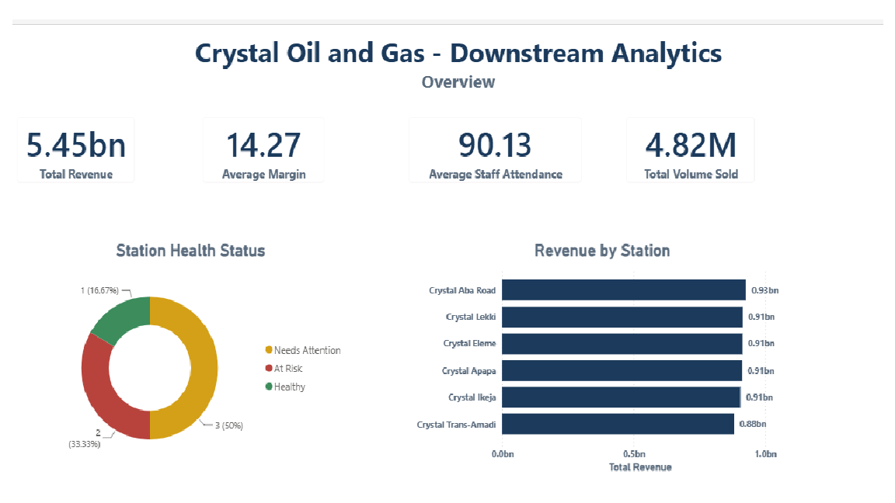
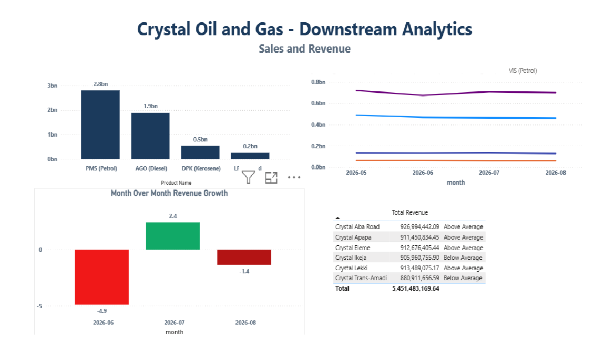
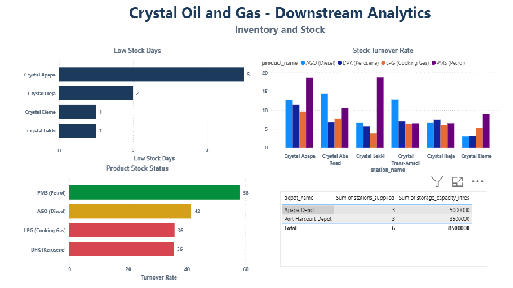
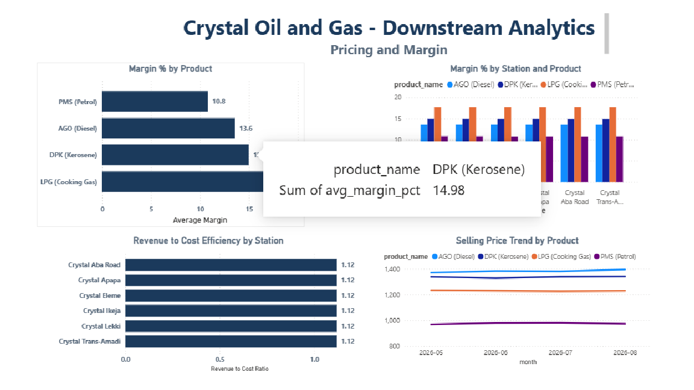
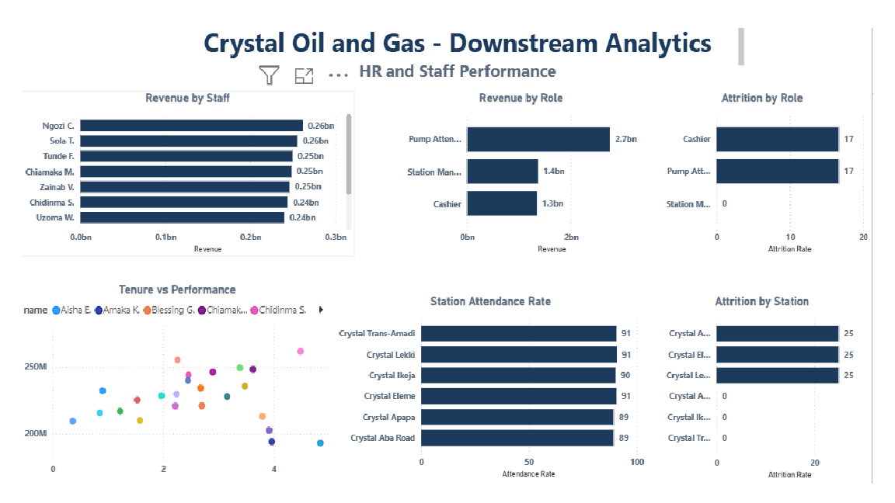
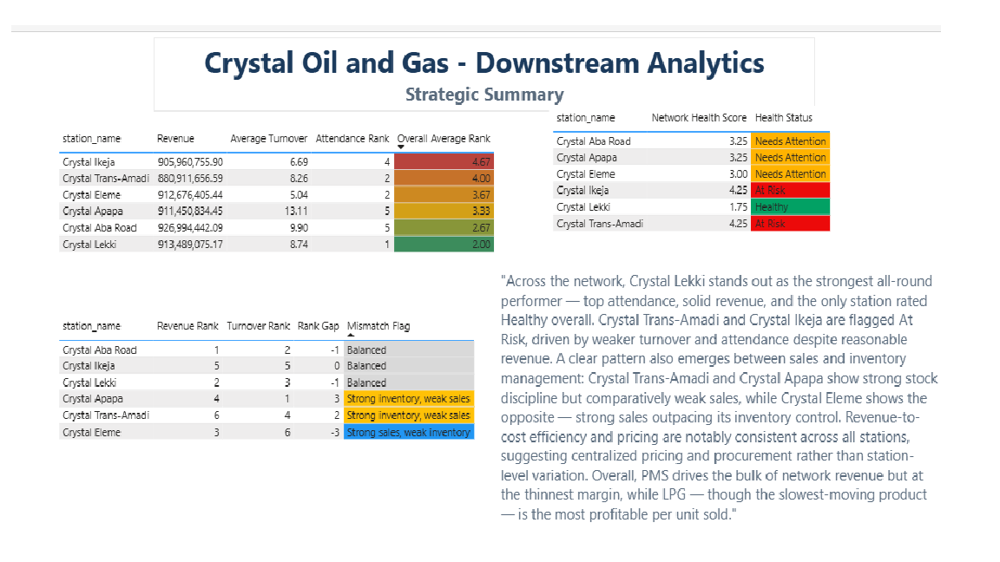

# Crystal Oil and Gas — Downstream Analytics

End-to-end downstream oil & gas analytics project — Excel, MySQL, and Power BI pipeline analyzing sales, inventory, pricing, and HR performance for a fictional Nigerian fuel distribution network.

---

## Overview

Crystal Oil and Gas is a fictional Nigerian downstream fuel distribution company, built for portfolio practice. It operates 6 fuel stations supplied by 2 depots across Lagos and Rivers State, selling four products — PMS (Petrol), AGO (Diesel), DPK (Kerosene), and LPG (Cooking Gas).

This project simulates a full analyst workflow from raw data to a finished, decision-ready dashboard:

1. *Excel* — raw source data generated as separate tables (stations, staff, sales, inventory, pricing, attendance)
2. *MySQL* — a normalized relational schema, with *22 business-question views* built on top of it covering sales, inventory, pricing, HR, and cross-domain strategy
3. *Power BI* — a 6-page interactive dashboard connected directly to those views

The goal throughout was to answer real business questions with SQL, not just report raw numbers — every view maps to a specific question a station manager, ops lead, or exec would actually ask.

---

## Tools Used

| Tool | Role |
|---|---|
| *Excel* | Raw data generation, initial structuring |
| *MySQL* | Relational schema, 22 analytical views (joins, window functions, CTEs, conditional logic) |
| *Power BI* | 6-page interactive dashboard, DAX-free (all logic pushed to SQL views), conditional formatting, cross-page filtering |

---

## Repository Structure

crystal-oil-gas-downstream-analytics/
├── sql/
│   ├── schema.sql        # Database + 8 CREATE TABLE statements, import steps
│   └── views.sql         # All 22 CREATE VIEW statements, grouped by category
├── dashboard/
│   └── crystal_oil_gas.pbix   # Power BI report file
├── screenshots/
│   ├── 01-overview.png
│   ├── 02-sales-revenue.png
│   ├── 03-inventory-stock.png
│   ├── 04-pricing-margins.png
│   ├── 05-hr-staff.png
│   └── 06-strategic-summary.png
└── README.md

---

## Data Structure

8 tables, built in dependency order (parent tables first):

| Table | Description |
|---|---|
| depots | 2 supply depots (Lagos, Rivers) with storage capacity |
| stations | 6 fuel stations, each linked to a depot |
| products | PMS, AGO, DPK, LPG |
| staff | 24 staff across 3 roles (Station Manager, Pump Attendant, Cashier), linked to a station |
| pricing | Monthly cost/selling price and margin per product |
| sales_transactions | 2,928 daily sales records (station × product × day) |
| inventory_stock | 2,928 daily stock movement records (opening/received/sold/closing) |
| attendance | 2,928 daily staff attendance records |

*Relationships:* stations → depots, staff → stations, pricing → products, sales_transactions → stations/products/staff, inventory_stock → stations/products, attendance → staff.

Full schema with data types, keys, and import steps: [sql/schema.sql](sql/schema.sql).

---

## Business Questions Answered

All 22 views live in [sql/views.sql](sql/views.sql), grouped into 5 categories:

*Sales & Revenue*
- Which stations generate the highest/lowest revenue?
- What is the sales trend by product over time?
- Which product contributes most to total revenue?
- What is the month-over-month revenue growth?
- Which stations underperform the network average?

*Inventory & Stock*
- Which stations/products frequently run low on stock?
- What is the average stock turnover rate per product/station?
- Are products overstocked or understocked?
- How does restock timing relate to sales dips?
- Which depot supplies the most stations, and is it near capacity?

*Pricing & Margins*
- Which product yields the highest/lowest margin?
- How do margins vary across stations for the same product?
- Has pricing changed over time, and how did it affect volume?
- Which stations have the best cost-to-revenue efficiency?

*HR & Staff Performance*
- Who are the top/bottom-performing staff by revenue?
- Is there a correlation between tenure and performance?
- What is the attendance rate per staff/station?
- Which roles/stations have the highest attrition?
- How does headcount relate to station output?

*Cross-domain / Strategic*
- Which stations are top all-round performers (sales + inventory + staff)?
- Are there stations with strong sales but weak inventory (or vice versa)?
- What is the overall network health picture, combining all four areas?

---

## Key Findings

- *Revenue is volume-driven, not margin-driven.* PMS dominates revenue but carries the thinnest margin (10.8%); LPG has the lowest revenue and slowest turnover, but the highest margin (17.7%) — a classic volume-vs-margin trade-off.
- *No sustained revenue decline.* Network revenue dipped after May and has stayed roughly flat since (±5% month to month), not trending downward.
- *LPG is the product most prone to low-stock days*, tracking with its smaller daily sales volume relative to the other three products.
- *Pricing and margins are consistent network-wide* — under 1 percentage point of margin variance across stations for the same product, suggesting centralized pricing rather than station-level strategy.
- *Revenue-to-cost efficiency is uniform* across all 6 stations (~1.12), meaning differences in profit are driven by sales volume, not cost management.
- *Crystal Lekki is the strongest all-round station* — top attendance, solid revenue, and the only station rated Healthy on the combined network health score. Crystal Ikeja and Crystal Trans-Amadi rank weakest and are flagged At Risk.
- *A clear sales-vs-inventory mismatch exists:* Crystal Apapa and Crystal Trans-Amadi show strong inventory discipline but comparatively weak sales; Crystal Eleme shows the opposite.
- *Small headcounts distort HR percentages.* With only 24 staff, a single person's status change can swing a group's attrition rate by double digits — treated as a caveat, not a strong signal, throughout the analysis.

---

## Dashboard Preview

*Overview*

*Sales & Revenue*

*Inventory & Stock*

*Pricing & Margins*

*HR & Staff Performance*

*Strategic Summary*

---

## SQL Highlights

A few queries that go beyond basic SELECTs, to show range:

*Window functions for period-over-period comparison:*
sql
CREATE VIEW vw_monthly_revenue_growth AS
SELECT
    month,
    SUM(revenue) AS total_revenue,
    LAG(SUM(revenue)) OVER (ORDER BY month) AS prev_month_revenue,
    ROUND(
        (SUM(revenue) - LAG(SUM(revenue)) OVER (ORDER BY month))
        / LAG(SUM(revenue)) OVER (ORDER BY month) * 100, 2
    ) AS growth_pct
FROM sales_transactions
GROUP BY month
ORDER BY month;

*CTEs + RANK() to combine metrics on different scales into one fair score:*
sql
WITH revenue_scores AS (SELECT station_id, total_revenue FROM vw_station_revenue),
turnover_scores AS (
    SELECT station_id, ROUND(AVG(turnover_rate), 2) AS avg_turnover
    FROM vw_stock_turnover GROUP BY station_id)
SELECT
    st.station_id, st.station_name,
    RANK() OVER (ORDER BY r.total_revenue DESC) AS revenue_rank,
    RANK() OVER (ORDER BY t.avg_turnover DESC) AS turnover_rank
FROM stations st
JOIN revenue_scores r ON r.station_id = st.station_id
JOIN turnover_scores t ON t.station_id = st.station_id;

*COUNT(CASE WHEN...) for rate calculations in a single pass:*
sql
ROUND(
    COUNT(CASE WHEN status = 'Present' THEN 1 END) / COUNT(*) * 100, 2
) AS attendance_rate_pct

See [sql/views.sql](sql/views.sql) for all 22 views in full.

---

## Assumptions & Limitations

- *Synthetic data.* All figures are randomly generated for practice — they do not represent a real company.
- *Staff attribution on sales.* The dataset does not distinguish who physically dispensed fuel vs. who processed payment, so vw_staff_performance attributes sales to whichever staff member (Manager, Attendant, or Cashier) is on the transaction record. In a real business, this would typically be scoped to Pump Attendants only.
- *Attrition is a snapshot, not a rate over time.* The staff table only has an Active/Inactive status, not hire/termination dates, so attrition figures reflect current status, not turnover velocity.
- *No depot-level stock tracking.* Inventory is tracked at the station level only, so "is a depot near capacity" can only be inferred from how many stations it supplies, not actual depot stock levels.
- *Small sample sizes.* With only 24 staff and 6 stations, percentage-based metrics (attrition, some margin comparisons) can swing significantly from a single data point — noted throughout rather than treated as statistically robust.

---

## How to Reproduce

1. Run [sql/schema.sql](sql/schema.sql) to create the database and 8 tables.
2. Import the source data into each table (see LOAD DATA statements at the bottom of schema.sql).
3. Run [sql/views.sql](sql/views.sql) to build all 22 views on top of the populated tables.
4. Open [dashboard/crystal_oil_gas.pbix](dashboard/crystal_oil_gas.pbix) in Power BI Desktop and point the MySQL connection at your local database.

---

Built as a practice portfolio project — Excel → MySQL → Power BI.
